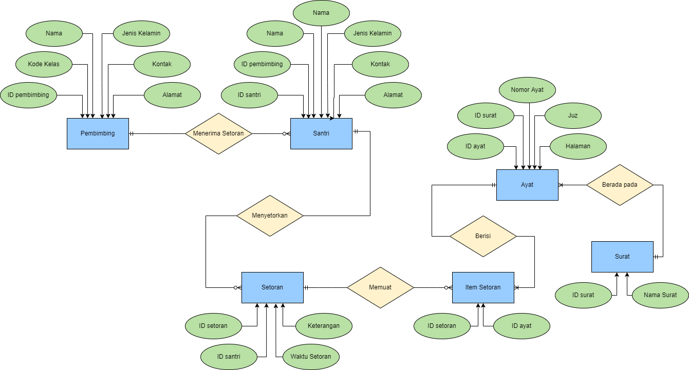
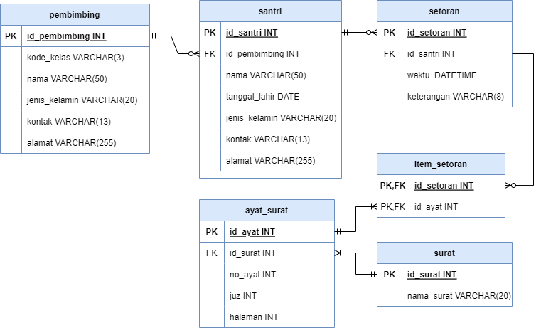

# Aplikasi Pencatatan Data Setoran Santri
Aplikasi ini dibuat untuk mempermudah pencatatan data setoran santri di lembaga tahfidz. Aplikasi memiliki fitur-fitur:
1. Mencacat, mengubah, dan menghapus data santri
2. Mencatat, mengubah, dan mengahpus data pembimbing
3. Mencatat, mengubah, dan menghapus data setoran santri
4. Visualisasi data santri

Untuk saat ini aplikasi baru bisa untuk mengolah data saja, harapannya, kedepannya aplikasi ini dapat berkembang menjadi aplikasi yang mewadahi lembaga tahfidz untuk melakukan program tahfidz melalui media online, agar semakin memudahkan bagi santri yang ingin menghafal Al-Qur'an dimana saja.
Selain itu, saya ingin menjadikan aplikasi ini sebagai pegangan santri tahfidz, untuk mengatur jadwal harian, jadwal murajaah, jadwal setoran, dan memonitor hafalan.

## Perancangan Database:
### Database Relational

### Entity Relation Diagram

### Source Code:
[Source Code Final Project](https://github.com/nentinur/final-project)
