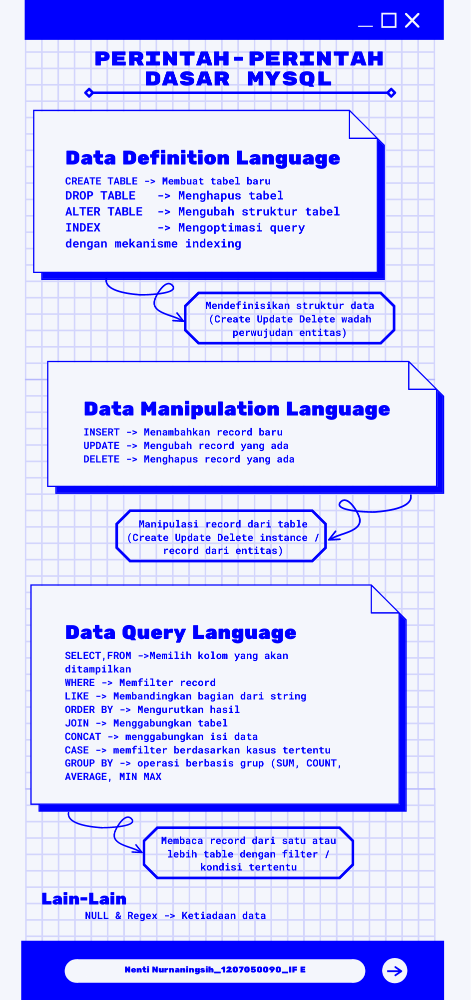

## Tugas 12 Mei 2022
1. Buat infografik / cheatsheet dari perintah-perintah MySQL di atas (boleh yang mau pake PostgreSQL)
2. Buat query untuk mencari penduduk berusia diatas 25 tahun yang berada di kabupaten 3204 dari data ini
---
1. 
2. 
3. ``` sql
   SELECT * FROM penduduk WHERE YEAR(CURRENT_DATE) - YEAR(tanggal_lahir) > 25 && kode_kabupaten = '3204';
   ```
