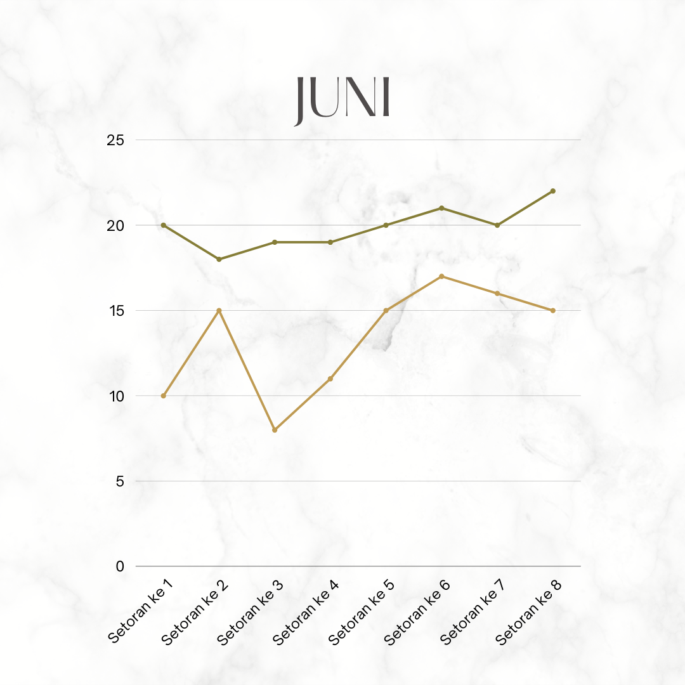
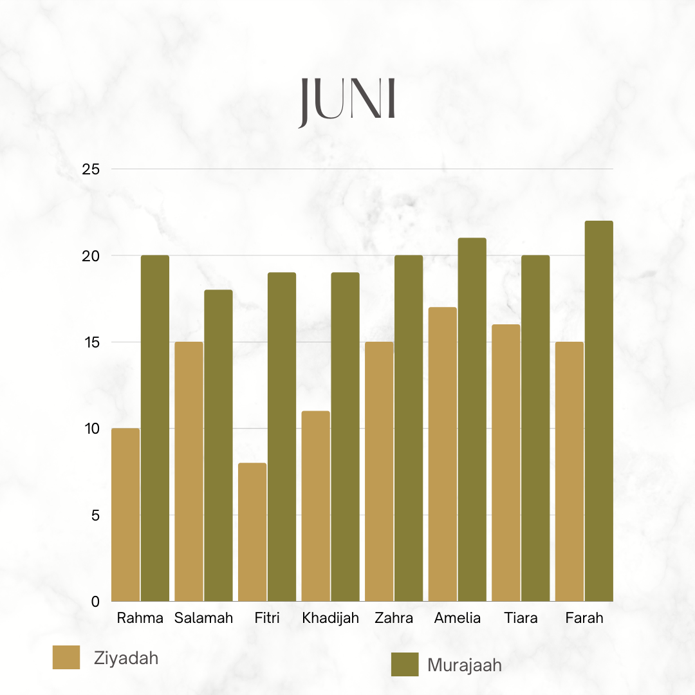

## Tugas:

1. Sebagai pemimpin organisasi / perusahaan, dari data hasil aplikasi yang sudah dibuat, tentukan masalah-masalah prioritas untuk dicari solusinya !
2. Tentukan struktur data dan bentuk visualisasinya ! Ada contoh visualisasinya (screenshot)
3. Buat query SQL untuk mendapatkan data no. 2 tersebut
---
1. - Ingin tahu perkembangan hafalan santri tiap setoran dalam 1 bulan

2. - Ingin tahu perkembangan hafalan santri perbulan
     - perkembangan per setoran santri
       - visualisasi: Line Chart
       - Data: Bulan, tahun, setoran ke, jumlah ayat yang disetorkan (Ziyadah & Murajaah)
     
     
     - perkembangan hafalan santri per bulan
       - visualisasi: Bar Chart
       - Data: Nama santri, bulan, tahun, jumlah setoran, jumlah ayat yang disetorkan (Ziyadah & Murajaah)
     

3. - Perkembangan per setoran santri Ziyadah
``` sql
     SELECT santri.nama, setoran.id_setoran, COUNT(item_setoran.id_ayat) FROM santri 
     INNER JOIN setoran ON santri.id_santri = setoran.id_santri 
     INNER JOIN item_setoran ON setoran.id_setoran = item_setoran.id_setoran 
     WHERE setoran.keterangan = "Ziyadah" && item_setoran.id_setoran = 1;
```
   - Perkembangan per setoran santri Murajaah
``` sql
     SELECT santri.nama, setoran.id_setoran, COUNT(item_setoran.id_ayat) FROM santri 
     INNER JOIN setoran ON santri.id_santri = setoran.id_santri 
     INNER JOIN item_setoran ON setoran.id_setoran = item_setoran.id_setoran 
     WHERE setoran.keterangan = "Murajaah" && item_setoran.id_setoran = 1;
```
   - Perkembangan hafalan santri perbulan (Ziyadah)
``` sql
     SELECT santri.nama, setoran.id_setoran, COUNT(item_setoran.id_ayat) FROM santri 
     INNER JOIN setoran ON santri.id_santri = setoran.id_santri 
     INNER JOIN item_setoran ON setoran.id_setoran = item_setoran.id_setoran 
     WHERE setoran.keterangan = "Ziyadah"
     GROUP BY santri.nama;
```
   - Perkembangan hafalan santri perbulan (Murajaah)
``` sql
     SELECT santri.nama, setoran.id_setoran, COUNT(item_setoran.id_ayat) FROM santri 
     INNER JOIN setoran ON santri.id_santri = setoran.id_santri 
     INNER JOIN item_setoran ON setoran.id_setoran = item_setoran.id_setoran 
     WHERE setoran.keterangan = "Murajaah"
     GROUP BY santri.nama;
```
