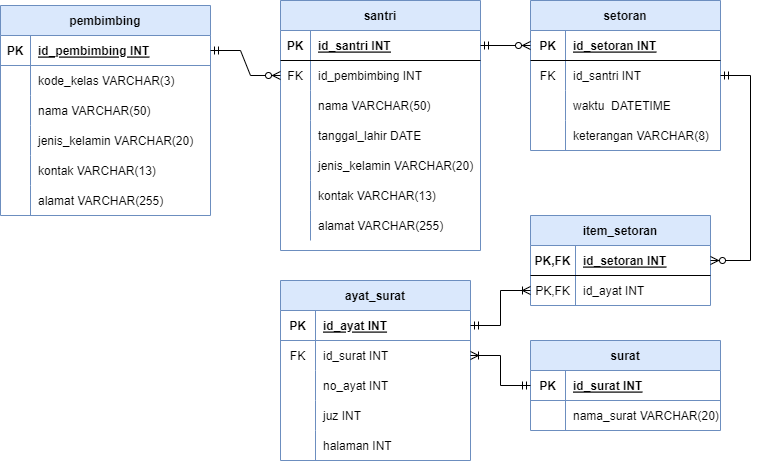

### Pertanyaan
1. Rancang solusi digital dari permasalahan yang teman-teman anggap penting untuk diselesaikan
2. Tentukan fitur-fitur utama dari solusi digital tersebut
3. Buat rancangan basis datanya dalam bentuk ER diagram
4. Buat model fisik dari basis datanya dalam bentuk query SQL yang meliputi: 1) data definition language untuk pembuatan tabel, 2) data manipulation language untuk contoh data awal, 3) data query language untuk analisis / business intelligence

### Jawaban
1. Aplikasi Pendataan Setoran Santri Program Tahfidz
  Aplikasi ini dibuat untuk mempermudah pendataan setoran santri di suatu lembaga tahfidz, khususnya yang kegiatannya itu diadakan secara online.

2. Fitur-fitur
  - Mencacat, mengubah, dan menghapus data santri
  - Mencatat, mengubah, dan mengahpus data pembimbing
  - Mencatat, mengubah, dan menghapus data setoran santri
  - Visualisasi data santri

3. ERD:
  

4. SQL
  ``` sql
  CREATE TABLE pembimbing (
id_pembimbing INT NOT NULL AUTO_INCREMENT PRIMARY KEY,
kode_kelas VARCHAR(3) NOT NULL,
nama VARCHAR(50) NOT NULL,
jenis_kelamin VARCHAR(20) NOT NULL,
kontak VARCHAR(13) NOT NULL,
alamat VARCHAR(255) NOT NULL
);

CREATE TABLE santri (
id_santri INT NOT NULL AUTO_INCREMENT PRIMARY KEY,
id_pembimbing INT NOT NULL,
nama VARCHAR(50) NOT NULL,
tanggal_lahir DATE NOT NULL,
jenis_kelamin VARCHAR(20) NOT NULL,
kontak VARCHAR(13) NOT NULL,
alamat VARCHAR(255) NOT NULL
);

CREATE TABLE setoran (
id_setoran INT NOT NULL AUTO_INCREMENT PRIMARY KEY,
id_santri INT NOT NULL,
waktu DATETIME NOT NULL,
keterangan VARCHAR(50) NOT NULL
);

CREATE TABLE ayat_surat (
id_ayat INT NOT NULL AUTO_INCREMENT PRIMARY KEY,
id_surat INT NOT NULL,
no_ayat INT NOT NULL,
juz INT NOT NULL,
halaman INT NOT NULL
);

CREATE TABLE surat (
id_surat INT NOT NULL AUTO_INCREMENT PRIMARY KEY,
nama_surat VARCHAR(20) NOT NULL
);

CREATE TABLE item_setoran (
id_setoran INT NOT NULL,
id_ayat INT NOT NULL,
PRIMARY KEY (id_setoran, id_ayat)
);


INSERT into pembimbing (id_pembimbing, kode_kelas, nama, jenis_kelamin, kontak, alamat) VALUES 
(1, "A01", "Halimatus Sholihah", "Perempuan", "089923230001", "Jakarta"),
(2, "A02", "Siti Fatimah", "Perempuan", "089923230002", "Bandung"),
(3, "I01", "Fajar Shiddiq", "Laki-Laki", "089923230003", "Bogor"),
(4, "I02", "Faiz Izzuddin", "Laki-Laki", "089923230202", "Tasikmalaya");

INSERT into santri (id_santri, id_pembimbing, nama, tanggal_lahir, jenis_kelamin, kontak, alamat) VALUES 
(1, 1, "Nurul Fauziyah", "2001-12-30", "Perempuan", "087745677969", "Bekasi" ),
(2, 2, "Fitri Kamelia", "2000-02-20", "Perempuan", "089923230006", "Surabaya"),
(3, 3, "Abdul Rifa'i", "2002-02-02", "Laki-Laki", "089923230007", "Sumedang"),
(4, 4, "Sofyan Alhikari", "2002-02-02", "Laki-Laki", "089933229990", "Subang");

INSERT into setoran (id_setoran, id_santri, waktu, keterangan) VALUES 
(1, 1, "2022-05-20 07:30:34", "Ziyadah"),
(2, 2, "2022-05-20 07:48:22", "Murajaah"),
(3, 3, "2022-05-20 08:17:18", "Ziyadah"),
(4, 4, "2022-05-20 08:30:18", "Murajaah");

INSERT into item_setoran (id_setoran, id_ayat) VALUES 
(1, 10),
(1, 11),
(2, 9),
(2, 10),
(3, 13),
(3, 14),
(4, 12),
(4, 13);

INSERT into ayat_surat (id_ayat, id_surat, no_ayat, juz, halaman) VALUES 
(1, 1, 1, 1, 1),
(2, 1, 1, 1, 1),
(3, 1, 1, 1, 1),
(4, 1, 1, 1, 1);

INSERT into surat (id_surat, nama_surat) VALUES 
(1, "Al-Fatihah"),
(2, "Al-Baqarah"),
(3, "Ali Imran"),
(4, "An-Nisaa");

SELECT santri.nama, pembimbing.kode_kelas AS kelas, pembimbing.nama AS nama_pembimbing FROM santri INNER JOIN pembimbing ON santri.id_pembimbing = pembimbing.id_pembimbing;

SELECT santri.nama, setoran.* FROM santri INNER JOIN setoran ON santri.id_santri = setoran.id_santri;


  ```
