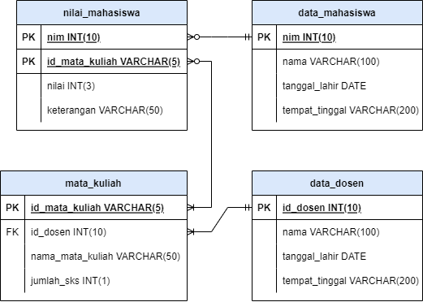

# UTS PRAKTIKUM BASIS DATA
**Nama: Nenti Nurnaningsih**
**NIM: 1207050090**
**Kelas: IF - E**
---

### SOAL
1. Jelaskan contoh-contoh perintah SQL beserta kegunannya !
2. Rancang solusi digital dari satu permasalahan yang ada di sekitar Anda.
A. Berdasarkan ERD yang telah dibuat, buatlah implementasi basis data dari ERD tersebut dalam bentuk tabel basis data lengkap dengan Primary Key, Foreign Key dengan menggunakan perintah CREATE TABLE bahasa SQL. Anda dapat menggunakan vendor basis data yang Anda sukai (MySQL / PostgreSQL / SQL Server / dsb.). Jika belum sempat install basis data di laptop, bisa menggunakan sqliteonline.com untuk mengecek keberhasilan pembuatan tabelnya.

### JAWABAN
1. - CREATE DATABASE (Digunakan untuk membuat database baru)
      ```sql
      CREATE DATABASE mahasiswa;
      ```
   - CREATE TABLE (Digunakan untuk membuat tabel baru pada database)
      ```sql
      CREATE TABLE data_mahasiswa (
        nim INT(10),
        nama_mahasiswa VARCHAR(100),
        tanggal_lahir DATE,
        tempat_tinggal VARCHAR(200)
      )   
      ```
   - SELECT (Digunakan untuk menampilkan data dari satu atau lebih tabel pada database yang sama)
      ```sql
      SELECT nama_mahasiswa FROM data_mahasiswa;
      ```
   - INSERT (Digunakan untuk menambahkan data baru ke dalam suatu tabel)
      ```sql
      INSERT INTO data_mahasiswa VALUES ('1207050090', 'Nenti Nurnaningsih', '2001-09-30', 'Bandung');
      ```
   - UPDATE (Digunakan untuk memperbarui atau mengubah nilai suatu record)
      ```sql
      UPDATE data_mahasiswa SET tempat_tinggal = 'Indramayu' WHERE nim = '1207050090';
      ```
   - DELETE (Digunakan untuk menghapus nilai dari suatu record)
      ```sql
      DELETE FROM data_mahasiswa WHERE nim = '1207050090'
      ```

2. DATABASE DATA NILAI MAHASISWA
- ERD
- 

- SQL
```sql

CREATE TABLE data_mahasiswa (
  nim INT(10) PRIMARY KEY,
  nama VARCHAR(100),
  tanggal_lahir DATE,
  tempat_tinggal VARCHAR(200)
);

CREATE TABLE data_dosen (
  id_dosen INT(10) PRIMARY KEY,
  nama VARCHAR(100),
  tanggal_lahir DATE,
  tempat_tinggal VARCHAR(200)
);

CREATE TABLE mata_kuliah (
  id_mata_kuliah VARCHAR(5) PRIMARY KEY,
  id_dosen INt(10),
  nama_mata_kuliah VARCHAR(50),
  jumlah_sks INt(1),
  CONSTRAINT id_dosen FOREIGN KEY (id_dosen) REFERENCES data_dosen (id_dosen)
);

CREATE TABLE nilai (
  nim INT(10),
  id_mata_kuliah VARCHAR(5),
  nilai INt(3),
  keterangan VARCHAR(10),
  PRIMARY KEY(nim, id_mata_kuliah)
);

```
